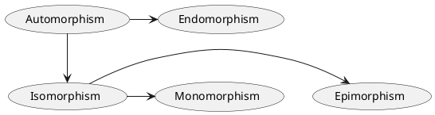

A ***homomosphism*** is a ***structure-preserving*** [[Mathematical Functions|map]] between two <u>algebraic structures</u> *(like [[Field|fields]], [[Group|groups]], or [[Vector Space|vector spaces]])* of the same type. ***Homomorphisms*** of <u>vector spaces</u> are also called [[Linear Map|linear maps]], and are the subject of study of <u>linear algebra</u>.

Some [[#Common Types of Homomorphisms|special cases]] include [[#Endomorphism|endomorphisms]] *(and [[#Automorphism|automorphisms]])*, [[#Isomorphism|isomorphisms]], [[#Monomorphism|monomorphisms]] and [[#Epimorphism|epimorphisms]].

# Formal Definition
For two <u>algebraic structures</u> $A,B$ *(like [[Field|fields]], [[Group|groups]], or [[Vector Space|vector spaces]])* of the same type, a ***homomosphism*** is a [[Mathematical Functions|map]] $\varphi: A\to B$ which ***preserves*** the <u>operations</u> of the structures. The <u>map</u> $\varphi: A\to B$ ***preserves*** *(or compatible with)* the operation $\mu$ *(is $n$-ary, and defined on both $A,B$)*, if for all $a_{1},\dots,a_{n} \in A$ we have
$$\large
\varphi\Big(\mu_{A}(a_{1},\dots,a_{n})\Big) = \mu_{B}\Big(\varphi(a_{1}), ..., \varphi(a_{k})\Big)
$$
The operations that must be ***preserved*** by a ***homomosphism*** include $0$-ary operations, i.e. constants. In particular, when an [identity element](https://en.wikipedia.org/wiki/Identity_element "Identity element") is required by the type of structure, the identity element of the first structure must be mapped to the corresponding identity element of the second structure.

# Common Types of Homomorphisms
Here is a diagram that summarises these types of <u>homomorphisms</u> 

with arrows representing that one type <u>is also</u> another type.

## Monomorphism
A ***monomorphism*** is an [[Mathematical Functions#Injective Functions|injective]] <u>homomorphism</u>. The implication of this is that if $\varphi: A \to B$ is a ***monomorphism***, then its [[Mathematical Functions#Function Inverses|left inverse]] $\varphi^{-1}: B \to A$ is an [[#Epimorphism|epimorphism]] with $\varphi$ being its [[Mathematical Functions#Function Inverses|right inverse]].

## Epimorphism
An ***epimorphism*** is a [[Mathematical Functions#Surjective Functions|surjective]] <u>homomorphism</u>. The implication of this is that if $\varphi: A \to B$ is an ***epimorphism***, then its [[Mathematical Functions#Function Inverses|right inverse]] $\varphi^{-1}: B \to A$ is a [[#Monomorphism|monomorphism]] with $\varphi$ being its [[Mathematical Functions#Function Inverses|left inverse]].

## Isomorphism
An ***isomorphism*** is both a [[#Monomorphism|monomorphism]] and [[#Endomorphism|epimorphism]], i.e. it is a [[Mathematical Functions#Bijective Functions|bijective]] <u>homomorphism</u>. The implication of this is that if $\varphi: A \to B$ is an ***isomorphism***, then so is its [[Mathematical Functions#Function Inverses|inverse]] $\varphi^{-1}: B \to A$.

## Endomorphism
An ***endomorphism*** is a <u>homomorphism</u> whose [[Mathematical Functions#Domains, co-domains, ranges|domain]] equals the [[Mathematical Functions#Domains, co-domains, ranges|codoman]], i.e. a <u>homomorphism</u> from an <u>algebraic structure</u> to itself.

### Automorphism
An ***automorphism*** is an [[#Endomorphism|endomorphism]] that is also an [[#Isomorphism|isomorphism]], i.e. it just renames the elements.

