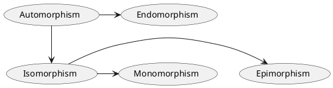

A ***linear map*** *(or linear transformation)* is a [[Homomorphism (algebraic)|homomorphism]] *(structure preserving transformation)* between two [[Vector Space|vector spaces]] defined over the same [[Field|field]].

# Formal Definition
Let $V,W$ be [[Vector Space|vector spaces]] over the same field $F$. The [[Mathematical Functions|map]] $\varphi: V \to W$ is said to be a ***linear map*** if for every $\mathbf{u},\mathbf{v} \in V$ and every $\lambda \in F$:
- ***Vector addition:*** $\varphi(\mathbf{u} + \mathbf{v}) = \varphi(\mathbf{u}) + \varphi(\mathbf{v})$
- ***Scalar multiplication:*** $\varphi(c\mathbf{u}) = c\varphi(\mathbf{u})$
Thus, a ***linear map*** is said to be *operation preserving*, so you can <u>distribute</u> it over a [[Vector Space#Linear Combination|linear combination]]
$$\large 
\varphi(\lambda_{1} \mathbf{u}_{1} + \dots + \lambda_{n} \mathbf{u}_{n}) 
= \lambda_{1}\varphi(\mathbf{u}_{1}) + \dots + \lambda_{n}\varphi(\mathbf{u}_{n})
$$

## Input, Output, and Image Spaces
The [[Mathematical Functions|domain]] $V$ of ***linear map*** $\varphi: V \to W$ is called its ***input space***, the [[Mathematical Functions#Domains, co-domains, ranges|co-domain]] $W$ is called its ***output space***, and the [[Mathematical Functions#Domains, co-domains, ranges|range]] is called its ***image***, denoted by $\mathrm{Im}(\varphi)$
$$\large \mathrm{Im}(\varphi) \ \ \triangleq \ \ 
\{ \ \mathbf{w} \in W \ | \ \exists \mathbf{x} \in V[\mathbf{w} = \varphi(\mathbf{x})] \ \}
$$
The ***image*** of $\varphi$ is also called it's ***image space*** because $\mathrm{Im}(\varphi)$ is a [[Linear Subspace|linear subspace]] of $W$.

# Properties
## Composition of Linear Maps
You can arbitrarily [[Mathematical Functions#Function Composition|compose]] <u>linear maps</u>, and the result will still be a <u>linear map</u>. So for *any* [[Vector Space|vector spaces]] $V,W,X$ over [[Field|field]] $F$, and any <u>linear maps</u> $\phi: V \to W$ and $\psi: W \to X$, it is guaranteed that  $\psi \circ \phi :V \to X$ will *also* be a <u>linear map</u>. This fact is what enables powerful constructions like [[Vector Space#Endomorphism Algebra of a Vector Space $ mathrm{End}(V)$|endomorphism algebras]] which let you perform algebraic manipulations on [[#Linear Endomorphism|endomorphisms]], as though they were numbers.

## Kernel and Rank–Nullity Theorem
If $\varphi: V \to W$ is a <u>linear map</u>, the ***kernel*** of $\varphi$ is the set of points $\mathbf{v} \in V$ for which $\varphi(\mathbf{v}) = \mathbf{0}_{W}$, and is denoted by $\ker(\varphi)$
$$\large \ker(\varphi) \ \ \triangleq \ \ 
\{ \ \mathbf{x} \in V \ | \ \varphi(\mathbf{x}) = \mathbf{0} \ \} \\
$$
The ***kernel*** of $\varphi$ is also called it's ***null space*** because $\ker(\varphi)$ is a [[Linear Subspace|linear subspace]] of $V$. By definition of <u>linear map</u> we know that $\varphi(\mathbf{0}_{V}) = \mathbf{0}_{W}$, so $\ker(\varphi)$ is <u>never empty</u>. Similarly, by definition of [[#Linear Monomorphism|injective]] we know that $\varphi \ \text{is injective} \iff \ker(\varphi) = \{ \mathbf{0}_{V} \}$
![[Pasted image 20240426211003.png|600]]
The the ***rank*** of $\varphi$ is the [[Vector Space#Dimension of Vector Space|number of dimensions]] of the [[#Input, Output, and Image Spaces|image space]] $\mathrm{Im}(\varphi)$, and is denoted by $\rank(\varphi)$. The ***nullity*** of $\varphi$ is the [[Vector Space#Dimension of Vector Space|number of dimensions]] of the ***null space*** $\ker(\varphi)$, and is denoted by $\mathrm{null}(\varphi)$
$$\large
\begin{align}
\mathrm{rank}(\varphi) \ \ &\triangleq \ \ \dim(\mathrm{Im}(\varphi)) \\
\mathrm{null}(\varphi) \ \ &\triangleq \ \ \dim(\ker(\varphi))
\end{align}
$$
The ***rank-nullity theorem*** is the following result which relates $\mathrm{rank}(\varphi)$ and $\mathrm{null}(\varphi)$
$$\large \mathrm{rank}(\varphi) + \mathrm{null}(\varphi) = \dim(V)$$

# Common Types of Homomorphisms
Here is a diagram that summarises these types of <u>linear maps</u>

with arrows representing that one type <u>is also</u> another type.

## Identity Map
For any [[Vector Space|vector space]] $V$, its ***identity map*** is $I_{V}:V \to V; \ \mathbf{v} \mapsto \mathbf{v}$. It is *(rather obviously)* a [[#Linear Automorphism|linear automorphism]].

## Zero Map
For any [[Vector Space|vector space]] $V$, its ***zero map*** is $0_{V}:V \to V; \ \mathbf{v} \mapsto \mathbf{0}_{V}$ where $\mathbf{0}_{V}$ is the [[Vector Space#Formal Definition|zero vector]]. It is *(rather obviously)* a [[#Linear Automorphism|linear automorphism]].

## Linear Isomorphism
A ***linear isomorphism*** is both a [[#Linear Monomorphism|linear monomorphism]] and [[#Linear Epimorphism|linear epimorphism]], i.e. it is a [[Mathematical Functions#Bijective Functions|bijective]] <u>linear map</u>. The implication of this is that if $\varphi: V \to W$ is a ***linear isomorphism***, then so is its [[Mathematical Functions#Function Inverses|inverse]] $\varphi^{-1}: W \to V$.

### Correspondence with Ordered Basis
Consider two [[Vector Space#Dimension of Vector Space|finite-dimensional]] [[Vector Space|vector spaces]] $V$ and $W$ over [[Field|field]] $F$. Then every ***linear isomorphism*** $\varphi: V \to W$ <u>uniquely</u> defines some [[Basis of Vector Space#Ordered Basis and Coordinate Vectors|ordered bases]] $B = (\mathbf{b}_{1}, \mathbf{b}_{2},\dots, \mathbf{b}_{n})$ and $D = (\mathbf{d}_{1}, \mathbf{d}_{2},\dots, \mathbf{d}_{n})$, of $V$ and $W$ respectively, such that for $1\leq k\leq n$
$$\large \varphi(\mathbf{b}_{k}) = \mathbf{d}_{k}$$
and thus, for every $\mathbf{v} \in V$ we have $\varphi(\mathbf{v}) = \alpha_{1} \mathbf{d}_{1} + \dots + \alpha_{n} \mathbf{d}_{n}$ - where $\alpha_{1},\dots,\alpha_{n}$ are [[Basis of Vector Space#Ordered Basis and Coordinate Vectors|coordinates]] of $\mathbf{v}$ relative to $B$. Conversely, specifying <u>ordered bases</u> $B$ and $D$ is equivalent to defining $\varphi$. We *could* denote the <u>unique</u> ***linear isomorphism*** specified by $B$ and $D$ by
$$\large V \cong_{DB} W$$
and denote the application of $V \cong_{DB} W$ ***left-to-right*** as $\sub{\eta}{\overset{DB}{\longleftarrow}}: V \to W$, and ***right-to-left*** as $\sub{\eta}{\overset{BD}{\longleftarrow}}: W \to V$; trivially all of $\sub{\eta}{\overset{DB}{\longleftarrow}} = (\sub{\eta}{\overset{BD}{\longleftarrow}})^{-1}, \ \ \sub{\eta}{\overset{BD}{\longleftarrow}} \circ \sub{\eta}{\overset{DB}{\longleftarrow}} = I_{V}, \ \ \sub{\eta}{\overset{DB}{\longleftarrow}} \circ \sub{\eta}{\overset{BD}{\longleftarrow}} = I_{W}$ hold. The $\eta$-notation is inspired by [natural transformations](https://en.wikipedia.org/wiki/Natural_transformation) but there doesn't exist any *standard* notation for this correspondence.

## Linear Endomorphism
An ***linear endomorphism*** is a <u>linear map</u> whose [[Mathematical Functions#Domains, co-domains, ranges|domain]] equals the [[Mathematical Functions#Domains, co-domains, ranges|codoman]], i.e. a <u>linear map</u> from a [[Vector Space|vector space]] to itself.

### Linear Automorphism
An ***linear automorphism*** is a [[#Linear Endomorphism|linear endomorphism]] that is also a [[#Linear Isomorphism|linear isomorphism]], i.e. it just renames the vectors. The set of all ***linear automorphisms*** on [[Vector Space|vector space]] $V$ over [[Field|field]] $F$ is called the [[Vector Space#General Linear Group of a Vector Space $ operatorname{GL}(V)$,$ mathrm{Aut}(V)$|general linear group]] $\mathrm{GL}(V)$.

## Linear Monomorphism
A ***linear monomorphism*** is an [[Mathematical Functions#Injective Functions|injective]] <u>linear map</u>. The implication of this is that if $\varphi: V \to W$ is a ***linear monomorphism***, then its [[Mathematical Functions#Function Inverses|left inverse]] $\varphi^{-1}: W \to V$ is a [[#Linear Epimorphism|linear epimorphism]] with $\varphi$ being its [[Mathematical Functions#Function Inverses|right inverse]].

## Linear Epimorphism
A ***linear epimorphism*** is a [[Mathematical Functions#Surjective Functions|surjective]] <u>linear map</u>. The implication of this is that if $\varphi: V \to W$ is a ***linear epimorphism***, then its [[Mathematical Functions#Function Inverses|right inverse]] $\varphi^{-1}: W \to V$ is a [[#Linear Monomorphism|linear monomorphism]] with $\varphi$ being its [[Mathematical Functions#Function Inverses|left inverse]].